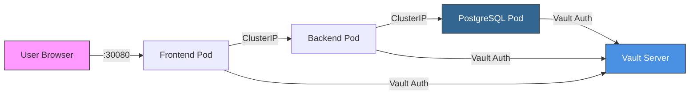

# 🚀 Blood Bank Kubernetes Deployment Guide

Complete guide for deploying the Blood Bank application on Kubernetes with HashiCorp Vault for secrets management.

## 📋 Table of Contents

- [Overview](#overview)
- [Prerequisites](#prerequisites)
- [Quick Start](#quick-start)
- [Architecture](#architecture)
- [Detailed Setup](#detailed-setup)
- [Access Information](#access-information)
- [Management](#management)
- [Troubleshooting](#troubleshooting)
- [Security](#security)

---

## 🎯 Overview

This Kubernetes setup provides:

- **Kind Cluster**: 3-node cluster (1 control-plane, 2 workers)
- **RBAC**: Role-Based Access Control for all components
- **HashiCorp Vault**: Centralized secrets management
- **Workload Identity**: Secure service authentication via ServiceAccounts
- **NetworkPolicies**: Restricted traffic between components
- **Persistent Storage**: PostgreSQL data persistence
- **High Availability**: Multiple replicas for frontend and backend

---

## 📦 Prerequisites

### Required Software

| Tool | Version | Installation |
|------|---------|-------------|
| Docker Desktop | Latest | [Download](https://docs.docker.com/desktop/install/windows-install/) |
| kubectl | 1.28+ | `choco install kubernetes-cli` |
| kind | 0.20+ | `choco install kind` |
| helm | 3.12+ | `choco install kubernetes-helm` |

### System Requirements

- **OS**: Windows 10/11 with WSL2
- **RAM**: 8GB minimum (16GB recommended)
- **CPU**: 4 cores minimum
- **Disk**: 20GB free space

### Verify Installation

```powershell
docker --version
kubectl version --client
kind version
helm version
```

---

## 🚀 Quick Start

### 1. Clone the Repository

```powershell
cd "d:\Project cá nhân\bloodbank"
```

### 2. Setup Kubernetes Cluster

```powershell
# Run automated setup (creates cluster + Vault)
.\k8s\scripts\setup.ps1

# This will:

# - Create Kind cluster with 3 nodes
# - Deploy HashiCorp Vault
# - Configure Vault Kubernetes auth
# - Populate secrets
```

### 3. Deploy Application

```powershell
# Build and deploy application
.\k8s\scripts\deploy.ps1

# This will:
# - Build Docker images for backend and frontend
# - Load images into Kind cluster
# - Deploy all Kubernetes resources
# - Run database migrations
# - Verify deployment
```

### 4. Access Application

- **Frontend**: http://localhost:30080
- **Backend API**: http://localhost:30000
- **Vault UI**: http://localhost:30820 (token: `root`)

---

## 🏗️ Architecture

### Cluster Structure

```
┌─────────────────────────────────────────────────┐
│  Kind Cluster (bloodbank-cluster)              │
│  ┌───────────────────────────────────────────┐ │
│  │  Control Plane Node                       │ │
│  │  - API Server                             │ │
│  │  - Scheduler                              │ │
│  │  - Controller Manager                     │ │
│  └───────────────────────────────────────────┘ │
│  ┌──────────────┐       ┌──────────────┐      │
│  │ Worker Node 1│       │ Worker Node 2│      │
│  │              │       │              │      │
│  │ App Pods     │       │ App Pods     │      │
│  └──────────────┘       └──────────────┘      │
└─────────────────────────────────────────────────┘
```

### Application Components

```
┌─────────────────────────────────────────────────┐
│  Namespace: bloodbank                          │
│                                                │
│  ┌──────────────┐    ┌──────────────┐         │
│  │  Frontend    │───▶│   Backend    │         │
│  │  (2 replicas)│    │  (2 replicas)│         │
│  └──────────────┘    └──────┬───────┘         │
│                             │                  │
│                             ▼                  │
│                      ┌──────────────┐          │
│                      │  PostgreSQL  │          │
│                      │  (StatefulSet)│         │
│                      └──────────────┘          │
│                                                │
│  All pods authenticate to Vault via           │
│  ServiceAccounts (Workload Identity)          │
└─────────────────────────────────────────────────┘

┌─────────────────────────────────────────────────┐
│  Namespace: vault                              │
│                                                │
│  ┌──────────────┐    ┌──────────────┐         │
│  │ Vault Server │    │ Agent Injector│        │
│  │              │    │               │        │
│  └──────────────┘    └───────────────┘        │
└─────────────────────────────────────────────────┘
```

### Network Flow



---

## 🔧 Detailed Setup

### Step 1: Create Kind Cluster

The `kind-config.yaml` defines a 3-node cluster:

```yaml
nodes:
  - role: control-plane
    extraPortMappings:
      - containerPort: 30080  # Frontend
      - containerPort: 30000  # Backend
      - containerPort: 30820  # Vault
  - role: worker
  - role: worker
```

### Step 2: Deploy Vault

Vault is deployed in **dev mode** for testing:

```powershell
kubectl apply -f k8s/vault/vault-rbac.yaml
kubectl apply -f k8s/vault/vault-deployment.yaml
kubectl apply -f k8s/vault/vault-service.yaml
```

**Dev Mode Settings:**
- Auto-initialized
- Auto-unsealed
- Root token: `root`
- In-memory storage (data lost on restart)

> [!WARNING]
> **Production Setup**: For production, use Vault in server mode with:
> - Proper initialization and unsealing
> - Secure storage backend (e.g., etcd, Consul)
> - TLS encryption
> - Auto-unseal with cloud KMS

### Step 3: Configure Vault Authentication

Enable Kubernetes auth backend:

```bash
vault auth enable kubernetes

vault write auth/kubernetes/config \
    kubernetes_host="https://$KUBERNETES_PORT_443_TCP_ADDR:443"
```

Create roles for each ServiceAccount:

```bash
# Backend role
vault write auth/kubernetes/role/bloodbank-backend \
    bound_service_account_names=bloodbank-backend-sa \
    bound_service_account_namespaces=bloodbank \
    policies=bloodbank-backend \
    ttl=24h
```

### Step 4: Populate Secrets

Secrets are stored in Vault's KV v2 engine:

```bash
# PostgreSQL credentials
vault kv put secret/bloodbank/postgres \
    username=postgres \
    password=bloodbank2024secure

# Backend secrets
vault kv put secret/bloodbank/backend \
    jwt_secret=bloodbank-jwt-secret-key-2024-very-secure \
    api_key=11102004

# Frontend secrets
vault kv put secret/bloodbank/frontend \
    api_key=11102004
```

### Step 5: RBAC Configuration

Each service has its own ServiceAccount:

- **bloodbank-backend-sa**: Can read secrets and configmaps
- **bloodbank-frontend-sa**: Can read configmaps
- **bloodbank-postgres-sa**: Can read configmaps

Roles are bound to these ServiceAccounts:

```yaml
apiVersion: rbac.authorization.k8s.io/v1
kind: RoleBinding
metadata:
  name: backend-secret-reader
subjects:
  - kind: ServiceAccount
    name: bloodbank-backend-sa
roleRef:
  kind: Role
  name: secret-reader
```

### Step 6: Workload Identity Integration

Pods use annotations to inject secrets from Vault:

```yaml
annotations:
  vault.hashicorp.com/agent-inject: "true"
  vault.hashicorp.com/role: "bloodbank-backend"
  vault.hashicorp.com/agent-inject-secret-database: "secret/data/bloodbank/postgres"
  vault.hashicorp.com/agent-inject-template-database: |
    {{- with secret "secret/data/bloodbank/postgres" -}}
    export DB_USER="{{ .Data.data.username }}"
    export DB_PASSWORD="{{ .Data.data.password }}"
    {{- end -}}
```

The Vault Agent Injector:
1. Detects pods with vault annotations
2. Injects a sidecar container
3. Authenticates using pod's ServiceAccount
4. Retrieves secrets from Vault
5. Writes secrets to `/vault/secrets/`

---

## 🌐 Access Information

### Service URLs

| Service | URL | Notes |
|---------|-----|-------|
| Frontend | http://localhost:30080 | Main application UI |
| Backend API | http://localhost:30000 | REST API endpoints |
| Backend Health | http://localhost:30000/health | Health check |
| Vault UI | http://localhost:30820 | Token: `root` |

### Internal Service Discovery

Services can communicate using Kubernetes DNS:

```
postgres.bloodbank.svc.cluster.local:5432
backend.bloodbank.svc.cluster.local:3000
frontend.bloodbank.svc.cluster.local:3000
vault.vault.svc.cluster.local:8200
```

### Ingress (Optional)

If you install an Ingress controller:

```
http://bloodbank.local          → Frontend
http://api.bloodbank.local      → Backend
```

Add to `C:\Windows\System32\drivers\etc\hosts`:

```
127.0.0.1 bloodbank.local api.bloodbank.local
```

---

## 🛠️ Management

### View Logs

```powershell
# Backend logs
kubectl logs -n bloodbank -l component=backend -f

# Frontend logs
kubectl logs -n bloodbank -l component=frontend -f

# PostgreSQL logs
kubectl logs -n bloodbank -l component=database -f

# Vault logs
kubectl logs -n vault -l app=vault -f

# All logs from a pod
kubectl logs -n bloodbank <pod-name> -f

# Logs from Vault sidecar
kubectl logs -n bloodbank <pod-name> -c vault-agent -f
```

### Shell Access

```powershell
# Backend shell
kubectl exec -it -n bloodbank deployment/backend -- sh

# Frontend shell
kubectl exec -it -n bloodbank deployment/frontend -- sh

# PostgreSQL shell
kubectl exec -it -n bloodbank statefulset/postgres -- psql -U postgres -d blood_bank

# Vault shell
kubectl exec -it -n vault vault-0 -- sh
```

### Scaling

```powershell
# Scale backend
kubectl scale -n bloodbank deployment/backend --replicas=3

# Scale frontend
kubectl scale -n bloodbank deployment/frontend --replicas=3

# View current replicas
kubectl get deployments -n bloodbank
```

### Updates

```powershell
# Rebuild and update backend
docker build -t bloodbank-backend:latest ./backend
kind load docker-image bloodbank-backend:latest --name bloodbank-cluster
kubectl rollout restart -n bloodbank deployment/backend

# Rebuild and update frontend
docker build -t bloodbank-frontend:latest ./frontend
kind load docker-image bloodbank-frontend:latest --name bloodbank-cluster
kubectl rollout restart -n bloodbank deployment/frontend

# Check rollout status
kubectl rollout status -n bloodbank deployment/backend
```

### Vault Operations

```powershell
# View all secrets
kubectl exec -n vault vault-0 -- vault kv list secret/bloodbank

# Read a secret
kubectl exec -n vault vault-0 -- vault kv get secret/bloodbank/backend

# Update a secret
kubectl exec -n vault vault-0 -- vault kv put secret/bloodbank/backend \
    jwt_secret=new-secret \
    api_key=11102004

# After updating secrets, restart pods to re-inject
kubectl rollout restart -n bloodbank deployment/backend
```

---

## 🔍 Troubleshooting

### Cluster Issues

**Problem**: Kind cluster won't start

```powershell
# Check Docker is running
docker ps

# Delete and recreate cluster
kind delete cluster --name bloodbank-cluster
.\k8s\scripts\setup.ps1
```

**Problem**: Pods stuck in Pending

```powershell
# Check pod details
kubectl describe pod -n bloodbank <pod-name>

# Check node resources
kubectl top nodes

# Check events
kubectl get events -n bloodbank --sort-by='.lastTimestamp'
```

### Vault Issues

**Problem**: Vault pods not ready

```powershell
# Check Vault logs
kubectl logs -n vault -l app=vault

# Check Vault status
kubectl exec -n vault vault-0 -- vault status
```

**Problem**: Secrets not injecting

```powershell
# Check Vault Agent Injector logs
kubectl logs -n vault -l app=vault-agent-injector

# Check pod annotations
kubectl get pod -n bloodbank <pod-name> -o yaml | grep vault

# Verify Vault role
kubectl exec -n vault vault-0 -- vault read auth/kubernetes/role/bloodbank-backend

# Check if secret exists
kubectl exec -n vault vault-0 -- vault kv get secret/bloodbank/backend
```

**Problem**: Pod can't authenticate to Vault

```powershell
# Check ServiceAccount
kubectl get sa -n bloodbank bloodbank-backend-sa

# Check RBAC
kubectl describe rolebinding -n bloodbank

# Check Vault auth config
kubectl exec -n vault vault-0 -- vault read auth/kubernetes/config
```

### Application Issues

**Problem**: Backend can't connect to database

```powershell
# Check PostgreSQL is running
kubectl get pods -n bloodbank -l component=database

# Test connection from backend pod
kubectl exec -n bloodbank deployment/backend -- nc -zv postgres.bloodbank.svc.cluster.local 5432

# Check PostgreSQL logs
kubectl logs -n bloodbank -l component=database
```

**Problem**: Frontend can't reach backend

```powershell
# Test backend health
curl http://localhost:30000/health

# Test from frontend pod
kubectl exec -n bloodbank deployment/frontend -- wget -qO- http://backend.bloodbank.svc.cluster.local:3000/health

# Check NetworkPolicy
kubectl describe networkpolicy -n bloodbank
```

### Network Issues

**Problem**: Can't access services via NodePort

```powershell
# Check service configuration
kubectl get svc -n bloodbank

# Check port mappings
docker ps | findstr bloodbank

# Test directly from container
docker exec bloodbank-cluster-control-plane curl http://localhost:30080
```

---

## 🔒 Security

### Current Security Features

✅ **RBAC**: Least-privilege access for all ServiceAccounts  
✅ **NetworkPolicies**: Restricted pod-to-pod communication  
✅ **Workload Identity**: No secrets in environment variables  
✅ **Vault Integration**: Centralized secrets management  
✅ **Non-root Containers**: All pods run as non-root users  
✅ **Resource Limits**: CPU and memory limits on all pods  

### Security Best Practices

> [!IMPORTANT]
> **Before Production:**
> 
> 1. **Vault Production Mode**
>    - Use proper Vault server (not dev mode)
>    - Enable auto-unseal with cloud KMS
>    - Configure backup and disaster recovery
>    - Enable audit logging
> 
> 2. **TLS Everywhere**
>    - Enable TLS for all services
>    - Use cert-manager for certificate management
>    - Configure mTLS between services
> 
> 3. **Network Security**
>    - Use Calico for advanced NetworkPolicies
>    - Implement egress filtering
>    - Use service mesh (e.g., Istio) for mTLS
> 
> 4. **Secret Rotation**
>    - Implement automated secret rotation
>    - Use Vault's dynamic secrets
>    - Configure short TTLs for tokens
> 
> 5. **Monitoring & Auditing**
>    - Enable Vault audit logs
>    - Monitor all API access
>    - Set up alerts for suspicious activity

### Rotating Secrets

```powershell
# Update secret in Vault
kubectl exec -n vault vault-0 -- vault kv put secret/bloodbank/backend \
    jwt_secret=new-jwt-secret-2024 \
    api_key=11102004

# Restart pods to pick up new secrets
kubectl rollout restart -n bloodbank deployment/backend

# Verify new secret is loaded
kubectl logs -n bloodbank -l component=backend | grep "JWT"
```

---

## 📚 Additional Resources

- [Kubernetes Documentation](https://kubernetes.io/docs/)
- [HashiCorp Vault Documentation](https://www.vaultproject.io/docs)
- [Vault Kubernetes Auth](https://www.vaultproject.io/docs/auth/kubernetes)
- [Kind Documentation](https://kind.sigs.k8s.io/)
- [Network Policies](https://kubernetes.io/docs/concepts/services-networking/network-policies/)

---

## 🆘 Getting Help

If you encounter issues:

1. Check the [Troubleshooting](#troubleshooting) section
2. Review logs: `kubectl logs -n bloodbank <pod-name>`
3. Check events: `kubectl get events -n bloodbank`
4. Verify Vault: `kubectl exec -n vault vault-0 -- vault status`

---

**Happy Deploying! 🚀**
